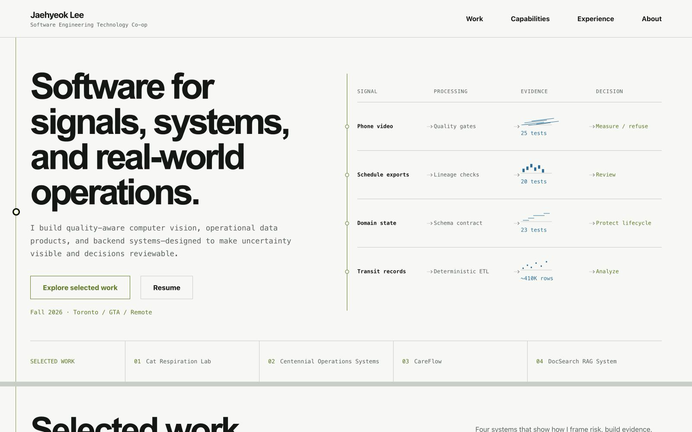
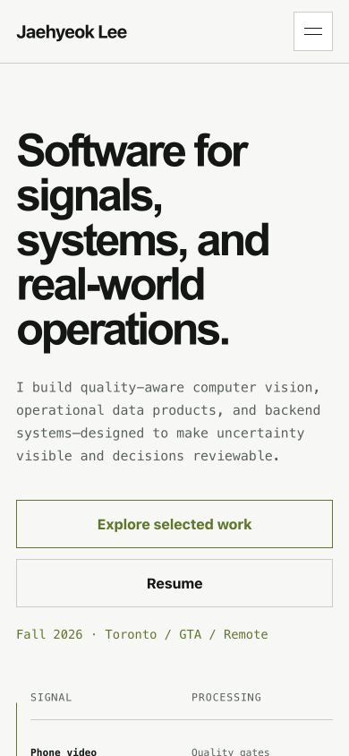

# Jaehyeok Lee Portfolio 2026

Static portfolio site for GitHub Pages or any static host. The site presents
Jaehyeok Lee through evidence-led engineering case studies across applied
computer vision, operational data, workflow automation, and backend systems.

[](https://eddie000321.github.io/)

## Preview

| Desktop | Mobile |
| --- | --- |
|  |  |

### Sanitized operations demo

[](https://youtu.be/Qcq_9weiisU)

The video uses a public-safe demonstration surface. Private schedules, ticket
text, names, internal URLs, and operational identifiers are excluded.

## Design and functionality

- All-light technical editorial design with mineral-white surfaces, pale sage and ice-blue section bands, and restrained olive/blue accents
- Signal-to-decision visual system carried through section transitions and evidence figures
- Four evidence-led selected-work stories with explicit decisions and boundaries
- Searchable, filterable archive containing 26 public-safe project summaries
- Dense responsive project rows that expand into implementation evidence
- Six capability groups, experience timeline, resume, and contact links
- Keyboard focus treatment, reduced-motion support, and mobile navigation

## Structure

```text
.
|-- index.html
|-- assets/
|   |-- css/site.css
|   |-- icons/favicon.svg
|   |-- resume/Jaehyeok_Lee_Resume.pdf
|   `-- js/site.js
|-- screenshots/
|   |-- desktop-preview.png
|   `-- mobile-preview.png
`-- portfolio-website-strategy-2026.md
```

## Local Preview

Open `index.html` directly in a browser.

For a local server:

```bash
python3 -m http.server 4173
```

Then open:

```text
http://localhost:4173
```

## GitHub Pages

1. Create a GitHub repository, for example `portfolio-2026`.
2. Push this folder's contents to the repository root.
3. In GitHub, open `Settings > Pages`.
4. Set source to `Deploy from a branch`.
5. Select the default branch and `/root`.

No build step is required.

## Content Notes

- Project content is kept in `assets/js/site.js`.
- Lead case studies expose context, engineering decision, verification evidence,
  and a known boundary instead of presenting unsupported claims.
- The public resume PDF is kept at `assets/resume/Jaehyeok_Lee_Resume.pdf`.
- Internal work is described only with anonymized or aggregate summaries.
- Do not add internal URLs, ticket numbers, asset tags, names, raw screenshots,
  credentials, or private workflow details.
- The current public contact surface is email, GitHub, LinkedIn, and resume PDF.
